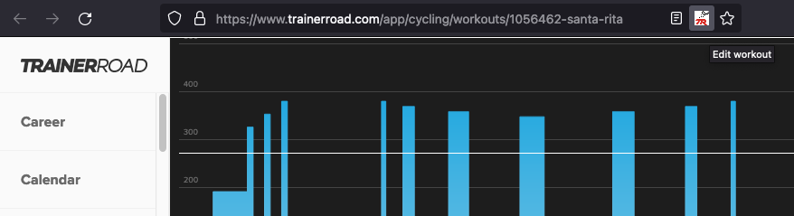

# Seasoned TrainerRoad Firefox extension

Adds button to browser address bar when viewing TrainerRoad workout page.
Clicking the button, opens the workout in [Zwiftout workout editor](https://nene.github.io/workout-editor),
which allows modifying the workout and downloading it as ZWO file
for use in Zwift.



## Building

```sh
yarn install
yarn build
```
